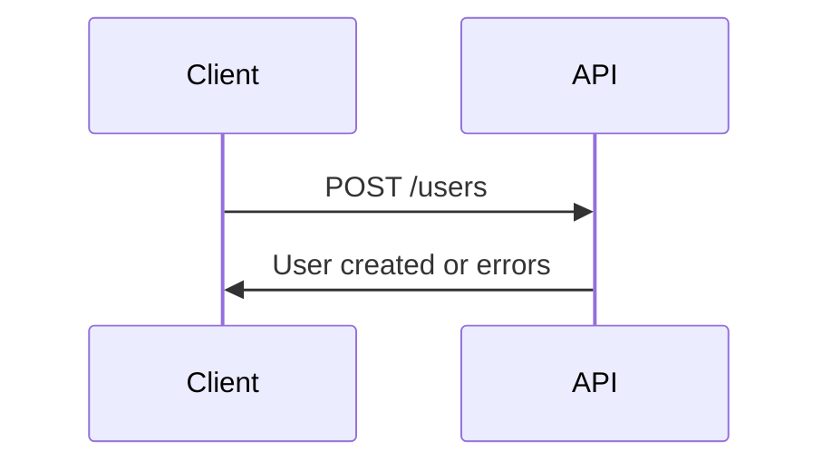
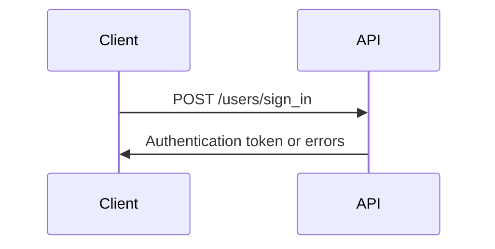
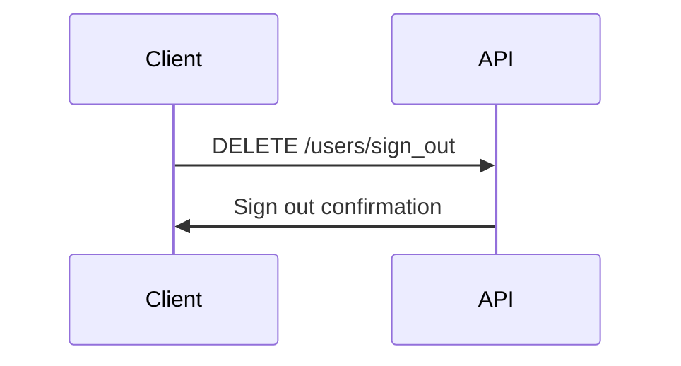
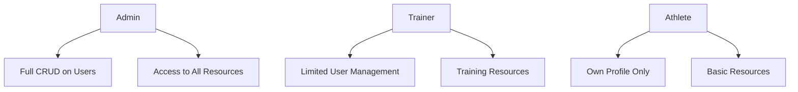

# Synergym API Documentation

## Milestone Progress

| Milestone | Status | Description |
|-----------|--------|-------------|
| **Milestone 1: Core Auth** | 🔄 In Progress (20%) | User registration, login, logout |
| **Milestone 2: Role-based Access** | ⏳ Not Started | Role permissions and access control |
| **Milestone 3: Advanced Features** | ⏳ Not Started | Extended API capabilities |
| **Milestone 4: API Implementation** | ⏳ Not Started | Actual API endpoints |
| **Milestone 5: API Integrations** | ⏳ Not Started | Third-party API integrations |

## Currently Implemented

**Important Note**: Despite documentation claims, no API endpoints have been implemented yet. The application currently uses traditional Rails HTML responses, not JSON API responses.

### What's Actually Implemented
- ✅ Rails routes for web-based authentication (HTML responses)
- ✅ Devise controllers for registration, login, logout (HTML responses)
- ✅ User model with roles enum
- ✅ Basic application structure

### What's Not Implemented
- ❌ No JSON API endpoints
- ❌ No API authentication tokens
- ❌ No API versioning
- ❌ No API documentation for actual endpoints
- ❌ No API response formatting

## Milestone 1: Core Authentication 🔄 (20% Complete)

### Sign Up

**Implementation Status:** Web Forms Only
- HTML form submission works for web interface
- No JSON API endpoint exists
- No API response format defined

### Sign In

**Implementation Status:** Web Forms Only
- HTML form submission works for web interface
- No JSON API endpoint exists
- No authentication tokens are generated

### Sign Out

**Implementation Status:** Web Forms Only
- HTML link works for web interface
- No JSON API endpoint exists
- No API response format defined

## Milestone 2: Role-based Access ⏳ (Not Started)

### User Roles

**Implementation Status:** Not Started
- User roles defined in model but not enforced
- No API endpoints for role-based access
- No API authorization policies

## Milestone 3: Advanced Features ⏳ (Not Started)

**Planned Features:**
- Extended API endpoints for training data
- Integration with third-party services
- Advanced analytics endpoints
- Real-time notifications

## Milestone 4: API Implementation ⏳ (Not Started)

**Planned Implementation:**
- JSON API endpoints for all resources
- API authentication using tokens
- API versioning strategy
- API response formatting and error handling

## Milestone 5: API Integrations ⏳ (Not Started)

**Planned Features:**
- Third-party service integrations
- Webhook implementations
- External API connections

## Quick Reference

| Endpoint | Method | Milestone | Status | Notes |
|----------|--------|-----------|--------|-------|
| `/users` | POST | 1 | ⚠️ Web Only | HTML form, not JSON API |
| `/users/sign_in` | POST | 1 | ⚠️ Web Only | HTML form, not JSON API |
| `/users/sign_out` | DELETE | 1 | ⚠️ Web Only | HTML link, not JSON API |
| Role-based endpoints | Various | 2 | ❌ Not Started | No API endpoints implemented |
| JSON API endpoints | Various | 4 | ❌ Not Started | No API implementation |