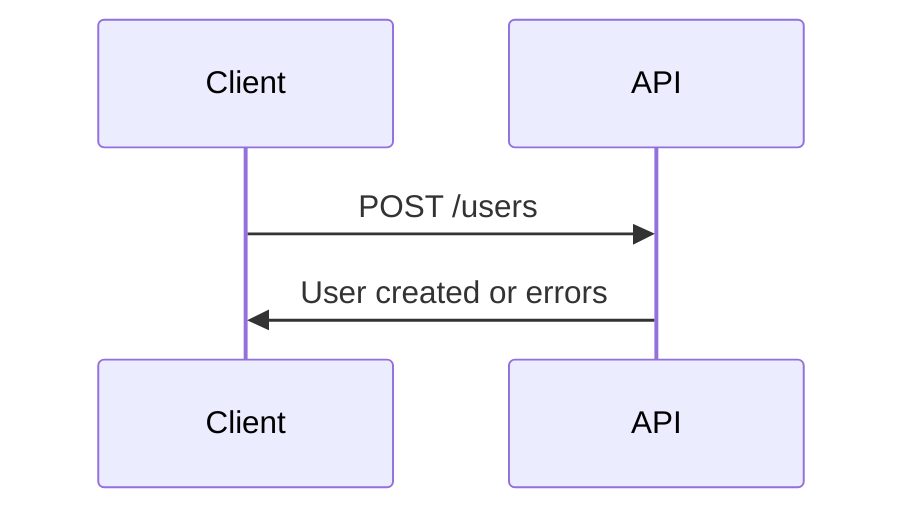
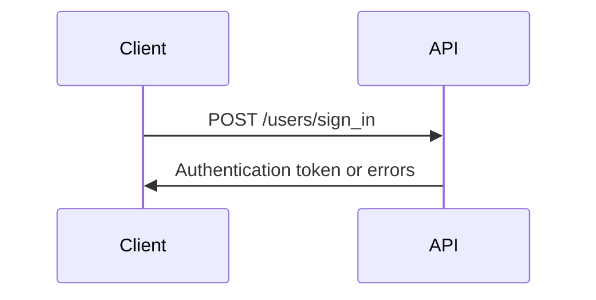
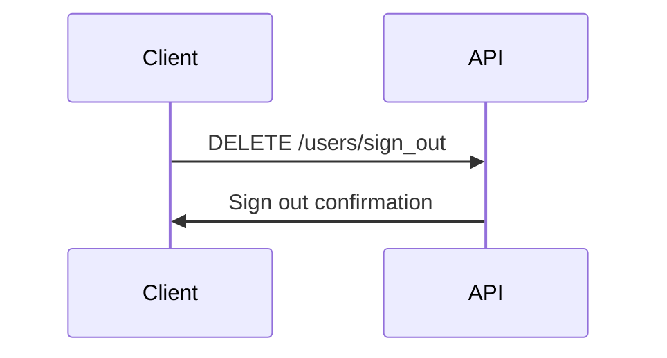

# Synergym API Documentation

## Authentication Endpoints

### Sign Up


### Sign In


### Sign Out


## User Roles

```mermaid
graph TD
    A[Admin] --> B[Full CRUD on Users]
    A --> C[Access to All Resources]
    D[Trainer] --> E[Limited User Management]
    D --> F[Training Resources]
    G[Athlete] --> H[Own Profile Only]
    G --> I[Basic Resources]