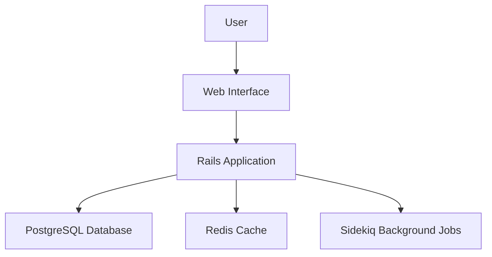
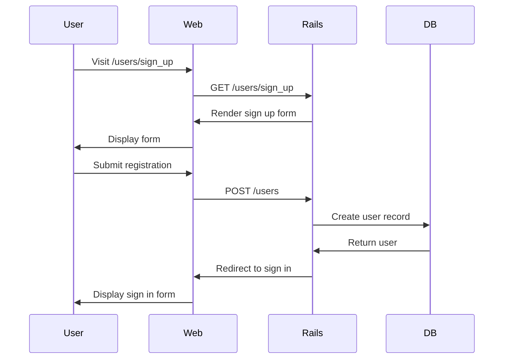
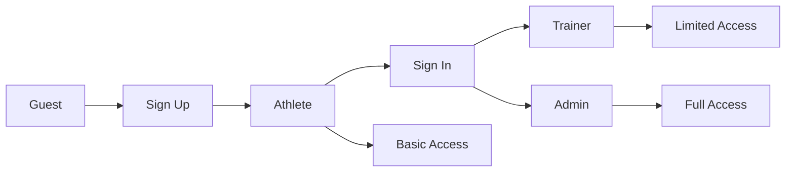
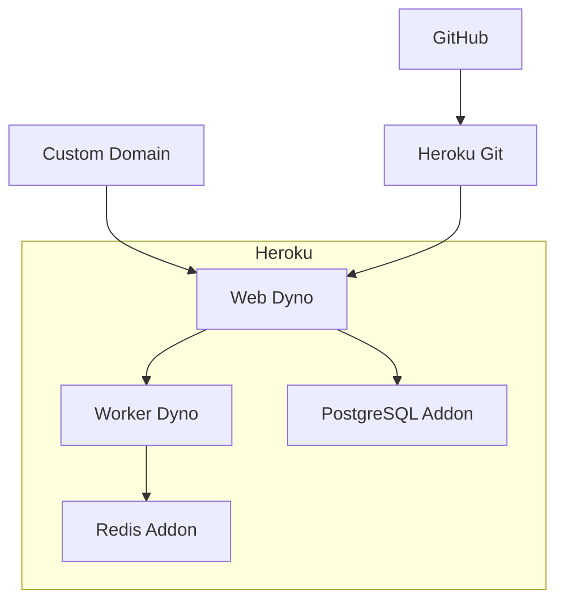

# Synergym Architecture

## Milestone Progress

| Milestone | Status | Description |
|-----------|--------|-------------|
| **Milestone 1: Foundation** | 🔄 In Progress (20%) | Core system architecture and authentication |
| **Milestone 2: Role-based Architecture** | ⏳ Not Started | Multi-role system architecture |
| **Milestone 3: Scalability** | ⏳ Not Started | Performance and scaling optimizations |
| **Milestone 4: API Architecture** | ⏳ Not Started | API endpoints and integration |
| **Milestone 5: Advanced Integrations** | ⏳ Not Started | Third-party integrations and analytics |

## Milestone 1: Foundation 🔄 (20% Complete)

### System Overview

**Implementation Status:** Partially Complete
- ✅ Rails 8 application structure
- ✅ PostgreSQL database integration
- ⚠️ Redis caching configured (basic setup)
- ⚠️ Sidekiq background jobs configured (no jobs implemented)

### User Authentication Flow

**Implementation Status:** Partially Complete
- ✅ Devise authentication implemented
- ✅ Registration and login flows functional
- ✅ Session management configured
- ⚠️ Google OAuth configured (limited testing)

## Milestone 2: Role-based Architecture ⏳ (Not Started)

### Role-based Authorization

**Implementation Status:** Not Started
- ❌ User roles defined (enum exists) but not enforced
- ❌ Pundit authorization policies (basic setup only)
- ❌ Role-based controllers (placeholder only)
- ❌ Dashboard routing by role (placeholder views only)

## Milestone 3: Scalability ⏳ (Not Started)

### Deployment Architecture

**Implementation Status:** Not Started
- ❌ Basic Heroku deployment configuration exists but incomplete
- ❌ Scaling strategies not implemented
- ❌ Monitoring and alerting not added
- ❌ Performance optimizations not implemented

## Milestone 4: API Architecture ⏳ (Not Started)

**Implementation Status:** Not Started
- ❌ No API endpoints implemented
- ❌ API authentication not configured
- ❌ API documentation not implemented

## Milestone 5: Advanced Integrations ⏳ (Not Started)

**Implementation Status:** Not Started
- ❌ Third-party integrations not implemented
- ❌ Analytics and reporting not configured
- ❌ Advanced features not started

## Current Limitations

Based on the actual implementation status, the following limitations exist in the current architecture:

### Authentication & Authorization
- User roles are defined in the model but not enforced in controllers
- Pundit policies exist but are minimal and not comprehensive
- Google OAuth is configured but has limited functionality and testing

### Dashboards & UI
- Dashboard routes exist but contain only placeholder HTML with no functionality
- No role-based access control is implemented
- Navigation is not properly restricted by user role

### Background Processing
- Sidekiq is configured but no actual background jobs are implemented
- Redis is set up but only used for basic Sidekiq functionality

### API Infrastructure
- No API endpoints have been implemented despite documentation claims
- No API authentication or versioning strategies in place

### Testing & Quality
- RSpec is configured but test coverage is minimal
- No integration tests for role-based functionality

## Quick Reference

| Component | Milestone | Status | Notes |
|-----------|-----------|--------|-------|
| Rails App | 1 | ✅ Complete | Core application structure |
| Authentication | 1 | 🔄 Partial | Devise integration complete, OAuth limited |
| Database | 1 | ✅ Complete | PostgreSQL configured |
| Background Jobs | 1 | ⚠️ Basic Setup | Sidekiq configured, no jobs implemented |
| Role System | 2 | ⚠️ Basic Setup | Model roles defined, not enforced |
| Dashboards | 2 | ❌ Placeholders | Routes and views only, no functionality |
| Authorization | 2 | ⚠️ Basic Setup | Pundit configured, minimal policies |
| Deployment | 3 | ❌ Incomplete | Basic files exist, not functional |
| API Endpoints | 4 | ❌ Not Started | No API implementation |