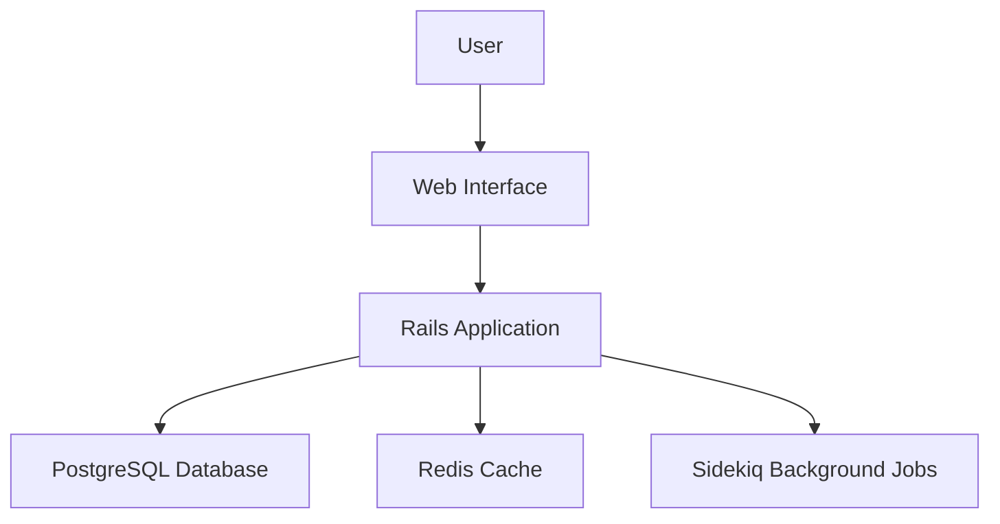
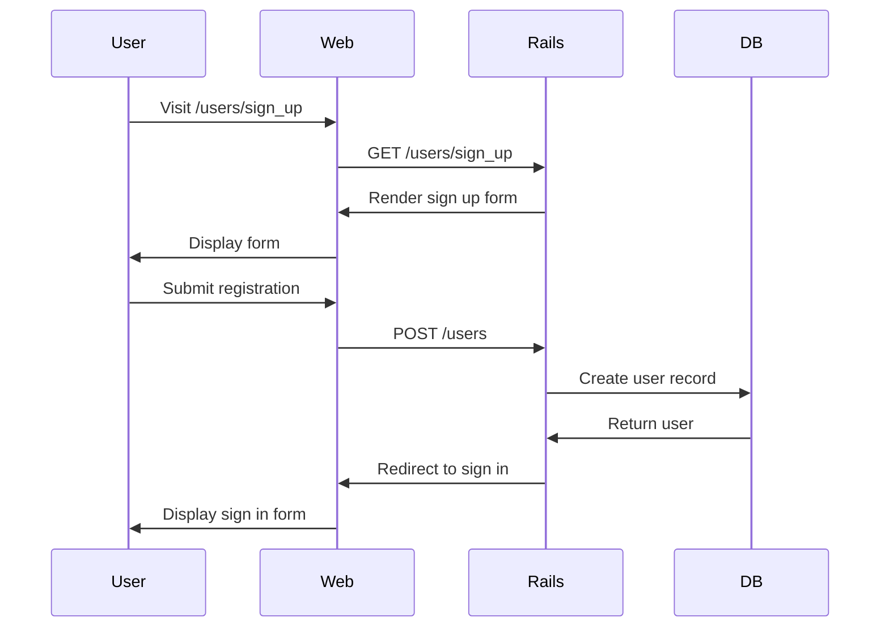
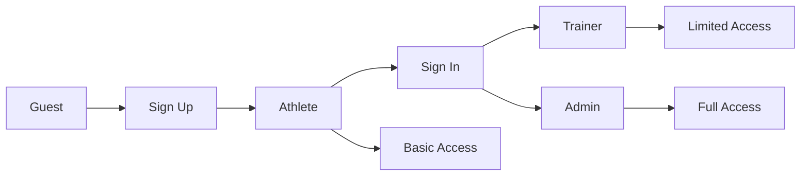

# Synergym Architecture

## System Overview



## User Authentication Flow



## Role-based Authorization



## Deployment Architecture

```mermaid
graph TB
    subgraph "Heroku"
        A[Web Dyno] --> B[Worker Dyno]
        A --> C[PostgreSQL Addon]
        B --> D[Redis Addon]
    end
    
    E[Custom Domain] --> A
    F[GitHub] --> G[Heroku Git]
    G --> A