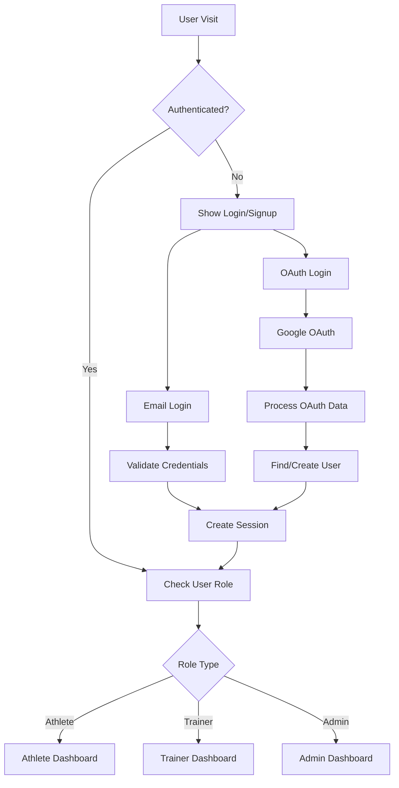
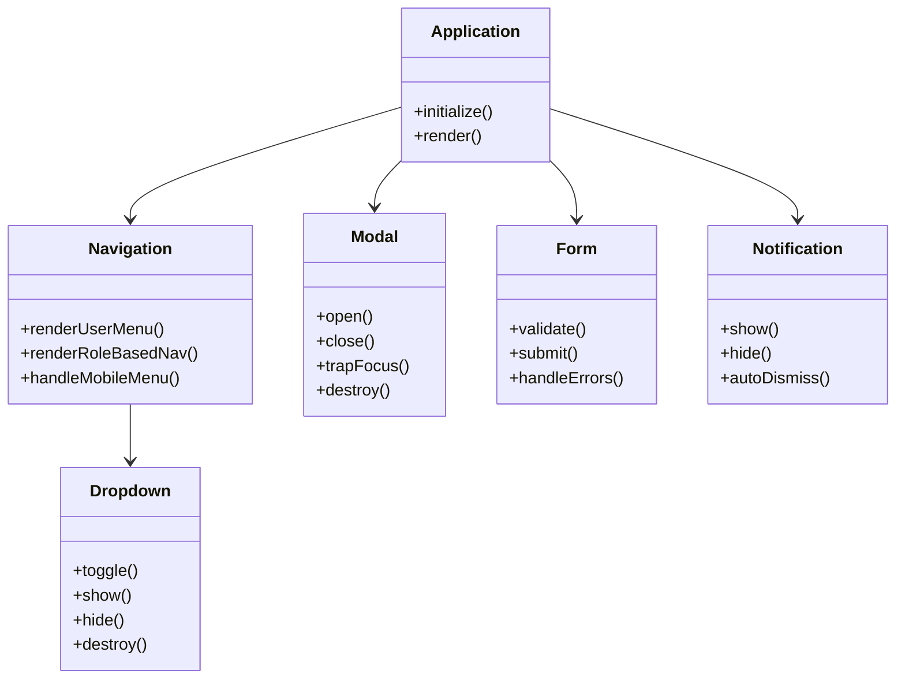
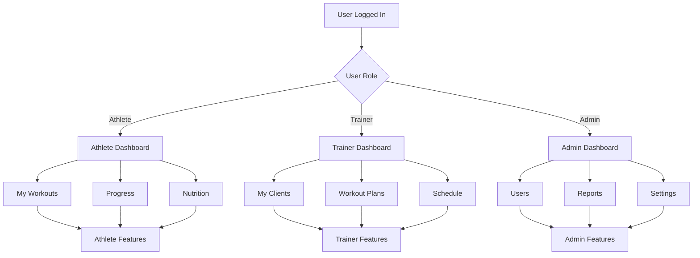
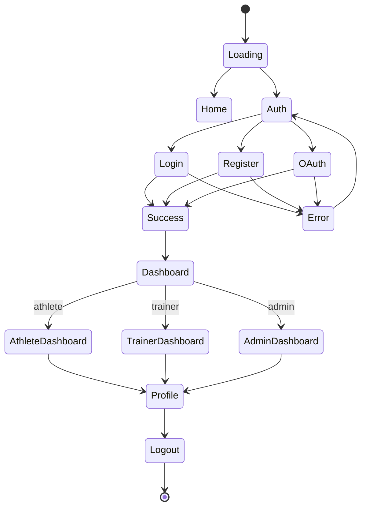
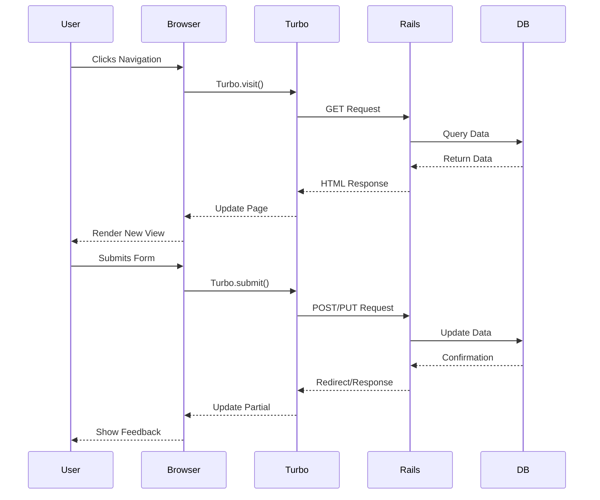

# Front-End Architecture Guide

## Milestone Progress

| Milestone | Status | Description |
|-----------|--------|-------------|
| **Milestone 1: Foundation** | 🔄 In Progress (20%) | Component system and core infrastructure |
| **Milestone 2: User Experience** | ⏳ Not Started | UI/UX improvements and responsiveness |
| **Milestone 3: Component Library** | ⏳ Not Started | Extended component library |
| **Milestone 4: PWA Features** | ⏳ Not Started | PWA capabilities and offline support |
| **Milestone 5: Advanced Features** | ⏳ Not Started | Real-time updates and advanced interactions |

## Overview

Synergym uses a modern, professional front-end stack built on Rails 8 with TailwindCSS and Hotwire. This architecture provides excellent performance, SEO benefits, and rapid development capabilities while maintaining a professional appearance.

## Technology Stack

### Core Technologies
- **Rails 8**: Backend framework with modern asset pipeline (Propshaft)
- **TailwindCSS**: Utility-first CSS framework for professional styling
- **Hotwire**: Turbo + Stimulus for modern interactivity without full SPA complexity
- **Importmap**: JavaScript dependency management without build complexity

### Key Advantages
1. **Performance**: Server-rendered pages with Turbo for fast navigation
2. **SEO**: Excellent search engine optimization with server-side rendering
3. **Development Speed**: Rails conventions + Hotwire = rapid development
4. **Professional UI**: TailwindCSS provides consistent, modern styling
5. **Lower Complexity**: No need for complex build tools or SPA frameworks

## Authentication Flow



## Component Architecture



## Role-Based Navigation Flow



## Application State Management



## User Interaction Patterns



## Current Implementation Status

### What's Actually Implemented (Milestone 1 - 20% Complete)
- ✅ Basic Rails 8 application structure with TailwindCSS
- ✅ Devise authentication views with Tailwind styling
- ✅ Basic JavaScript component structure (files exist)
- ✅ Basic layout structure with navigation placeholder
- ✅ Basic dashboard views (placeholders only)

### What's Partially Implemented
- ⚠️ Component files exist but have limited functionality
- ⚠️ Navigation structure exists but no role-based behavior
- ⚠️ Form validation works for Devise forms only
- ⚠️ Basic notification system (flash messages only)

### What's Not Yet Implemented
- ❌ Functional role-based navigation
- ❌ Interactive components (modals, dropdowns with limited functionality)
- ❌ Form validation for custom forms
- ❌ Responsive design optimizations
- ❌ Accessibility features
- ❌ Component library
- ❌ PWA features
- ❌ Real-time updates

## Quick Reference

| Component | Milestone | Status | Notes |
|-----------|-----------|--------|-------|
| Component System | 1 | ⚠️ Basic Setup | Component files exist with limited functionality |
| Navigation | 1 | ⚠️ Basic Setup | Structure exists, no role-based behavior |
| Form Validation | 1 | ⚠️ Basic Setup | Devise validation only |
| Notifications | 1 | ⚠️ Basic Setup | Flash messages only |
| Responsive Design | 2 | ❌ Not Started | Mobile optimization not implemented |
| Accessibility | 2 | ❌ Not Started | WCAG compliance not addressed |
| Performance | 2 | ❌ Not Started | No optimizations implemented |
| Component Library | 3 | ❌ Not Started | Extended component set not created |
| PWA Features | 4 | ❌ Not Started | Offline capabilities not implemented |
| Real-time Updates | 5 | ❌ Not Started | Live features not implemented |

## Implementation Guidelines

### Component Development
1. Create file in `app/javascript/components/component-name.js`
2. Export as default class with constructor and methods
3. Add to `app/javascript/components/index.js`
4. Initialize in `application.js` if needed globally

### Styling Conventions
- Use Tailwind utility classes for 90% of styling
- Create component classes for complex, repeated patterns
- Maintain consistent spacing using the spacing scale
- Use semantic color names (primary, secondary, etc.)

### Accessibility Standards
- All interactive elements keyboard accessible
- Proper ARIA labels and roles
- Focus management in modals and dropdowns
- Color contrast ratios (WCAG AA minimum)
- Screen reader friendly markup

### Performance Optimization
- Lazy load images and components
- Optimize TailwindCSS purging
- Minimize JavaScript bundle size
- Use Turbo for fast navigation
- Implement proper caching headers

## File Structure

```
app/javascript/
├── components/
│   ├── dropdown.js
│   ├── modal.js
│   ├── form.js
│   ├── notification.js
│   └── index.js
├── controllers/
│   ├── application.js
│   ├── flash_controller.js
│   └── index.js
└── application.js

app/views/
├── layouts/
│   └── application.html.erb
├── shared/
│   └── _navigation.html.erb
└── [feature_views]/

app/assets/stylesheets/
├── application.css
└── tailwind/
    └── application.css
```

## Current Limitations

Based on the actual implementation status, the following limitations exist in the current front-end:

### Component System
- Component files exist but most contain only basic structure
- Limited interactivity and functionality
- No reusable component library established

### Navigation & Routing
- Navigation structure exists but doesn't adapt to user roles
- No client-side routing enhancements
- Mobile navigation not fully implemented

### Forms & Validation
- Only Devise authentication forms have validation
- Custom forms lack validation feedback
- No advanced form features (multi-step, conditional fields)

### User Experience
- No responsive design optimizations
- Accessibility features not implemented
- No loading states or error handling for user interactions

### Performance
- No performance optimizations implemented
- No lazy loading of components or images
- No caching strategies for front-end assets

## Conclusion

This front-end architecture provides a solid foundation for a professional, scalable application. The combination of Rails 8, TailwindCSS, and Hotwire offers the best balance of development speed, performance, and maintainability for a public-facing application like Synergym.

While the basic structure is in place, most components are currently placeholders or have limited functionality. The architecture supports future growth and can accommodate additional features as the application evolves, but significant development work is needed to implement the planned features.

The next priorities should be:
1. Implementing functional role-based navigation
2. Adding proper form validation and error handling
3. Creating responsive design optimizations
4. Building out the component library with reusable elements
5. Implementing accessibility features